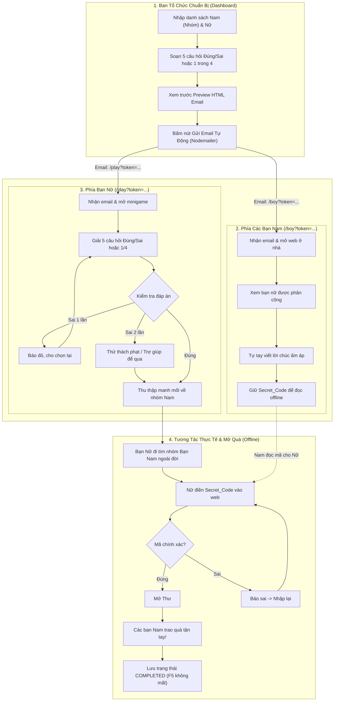

# GDG-HUST-Website-20-10-26

```mermaid
flowchart TD
    %% 1. BAN TỔ CHỨC Ở TRÊN CÙNG
    subgraph G1 ["1. Ban Tổ Chức Chuẩn Bị (Dashboard)"]
        direction TB
        A1["Nhập danh sách Nam (Nhóm) & Nữ"] --> A2["Soạn 5 câu hỏi Đúng/Sai hoặc 1 trong 4"]
        A2 --> A3["Xem trước Preview HTML Email"]
        A3 --> A4["Bấm nút Gửi Email Tự Động (Nodemailer)"]
    end

    A4 -->|Email: /boy?token=...| B1
    A4 -->|Email: /play?token=...| C1

    subgraph TWO_COLUMNS [" "]
        direction LR

        %% CỘT TRÁI: BẠN NAM
        subgraph G2 ["2. Phía Các Bạn Nam (/boy?token=...)"]
            direction TB
            B1["Nhận email & mở web ở nhà"] --> B2["Xem bạn nữ được phân công"]
            B2 --> B3["Tự tay viết lời chúc ấm áp"]
            B3 --> B4["Giữ Secret_Code để đọc offline"]
        end

        %% CỘT PHẢI: BẠN NỮ
        subgraph G3 ["3. Phía Bạn Nữ (/play?token=...)"]
            direction TB
            C1["Nhận email & mở minigame"] --> C2["Giải 5 câu hỏi Đúng/Sai hoặc 1/4"]
            C2 --> C3{"Kiểm tra đáp án"}
            C3 -->|Sai 1 lần| C4["Báo đỏ, cho chọn lại"]
            C3 -->|Sai 2 lần| C5["Thử thách phạt / Trợ giúp để qua"]
            C4 --> C2
            C5 --> C6["Thu thập manh mối về nhóm Nam"]
            C3 -->|Đúng| C6
        end
    end

    %% 4. KẾT HỢP OFFLINE Ở DƯỚI CÙNG
    subgraph G4 ["4. Tương Tác Thực Tế & Mở Quà (Offline)"]
        direction TB
        D1["Bạn Nữ đi tìm nhóm Bạn Nam ngoài đời"] --> D2["Nữ điền Secret_Code vào web"]
        D2 --> D3{"Mã chính xác?"}
        D3 -->|Đúng| D4["Mở Thư"]
        D4 --> D5["Các bạn Nam trao quà tận tay!"]
        D5 --> D6["Lưu trạng thái COMPLETED (F5 không mất)"]
        D3 -->|Sai| D7["Báo sai -> Nhập lại"]
        D7 --> D2
    end

    C6 --> D1
    B4 -.->|Nam đọc mã cho Nữ| D2
```
